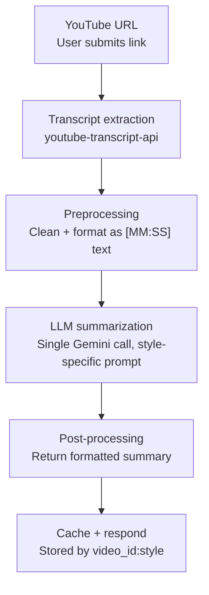

# Gist — YouTube Video Summarizer

Paste a YouTube URL, pick a summary style, get back a transcript-based
summary. No video download, no YouTube API key — just the caption track and
an LLM call.

## Overview

| | |
|---|---|
| **Backend** | FastAPI (`main.py`) |
| **Frontend** | Single static page (`index.html`), no build step |
| **Transcript source** | `youtube-transcript-api` (scrapes YouTube's caption track) |
| **Summarization** | Gemini API (`gemini-2.0-flash`) |
| **Caching** | In-memory, keyed by `video_id:style` |

## Architecture



**Request flow:**

1. Frontend `POST`s `{ url, style }` to `/api/summarize`.
2. Backend extracts the video ID from the URL via regex.
3. `youtube-transcript-api` fetches the caption track for that video ID —
   this is the step most exposed to YouTube-side blocking (see *Known
   issues* below).
4. Captions are joined into `[MM:SS] text` lines so the model can cite
   timestamps back.
5. One Gemini call summarizes the transcript, using one of three prompts
   depending on the selected `style`:
   - `tldr_bullets` — TL;DR + key points
   - `chapters` — chapter breakdown with timestamps
   - `study_notes` — notes + quiz questions
6. Result is cached by `video_id:style` and returned as JSON. A repeat
   request for the same video + style is served from cache instantly.

This is a **single-pass architecture** — the whole transcript goes into one
LLM call. There's a guard rail (`SINGLE_PASS_CHAR_LIMIT` in `main.py`) that
rejects transcripts too long to fit in one call; map-reduce chunking
(summarize in pieces, then summarize the summaries) is the natural upgrade
once that limit starts getting hit in practice, but isn't built yet.

## Project structure

```
youtube-summarizer/
├── backend/
│   ├── main.py            # FastAPI app: routes, transcript fetch, Gemini call
│   ├── requirements.txt
│   ├── .env.example       # template — copy to .env and fill in your key
│   └── .gitignore         # excludes .env and __pycache__/ from git
├── frontend/
│   └── index.html         # single-page UI, talks to localhost:8000
└── README.md
```

## Setup

### 1. Get a Gemini API key

Free tier available at [Google AI Studio](https://aistudio.google.com/apikey).

### 2. Backend

```powershell
cd backend
python -m venv venv
venv\Scripts\Activate.ps1
pip install -r requirements.txt

copy .env.example .env
# open .env and paste your real key in place of "your_key_here"

python -m uvicorn main:app --reload --port 8000
```

macOS/Linux:

```bash
cd backend
python -m venv venv
source venv/bin/activate
pip install -r requirements.txt

cp .env.example .env
# edit .env and paste your key

uvicorn main:app --reload --port 8000
```

The key is loaded automatically from `.env` via `python-dotenv` — no manual
environment variable export needed.

Confirm it's running: `http://127.0.0.1:8000/api/health` → `{"status": "ok"}`

### 3. Frontend

Open `frontend/index.html` directly in a browser, or serve it:

```bash
cd frontend
python -m http.server 5501
# then visit http://localhost:5501
```

## Recent changes

- **Gemini quota handling**: catches `ResourceExhausted` from the Gemini
  SDK and returns a proper `429` with the message *"Gemini API quota
  exceeded. Please wait and try again later."* instead of a raw stack
  trace.
- **Frontend error handling improved**: backend errors now display the
  actual JSON `detail` message; genuine network failures (backend not
  running) show a distinct, clearer "can't reach localhost" message
  instead of both cases looking identical.
- **`.gitignore` added**: excludes `.env` and Python cache files
  (`__pycache__/`, etc.) so the API key and build artifacts never get
  committed.
- **Removed API-key prefix logging** from backend startup — the earlier
  debug line that printed the first few characters of the key to the
  terminal has been taken out now that the env-loading issue is confirmed
  fixed.
- **Verified working**: backend health check responds at
  `http://127.0.0.1:8000/api/health`; frontend confirmed working served
  from `http://127.0.0.1:5501`.

## Known issues

### Gemini quota exceeded (current blocker)

The configured Gemini API key/project has hit its quota. This is **not** a
code, frontend, or localhost connectivity problem — the backend and
frontend are both confirmed working correctly. To resolve:

- Wait for the quota to reset (free-tier quotas typically reset daily), or
- Rotate to a new API key / project with fresh quota.

### YouTube transcript blocking

Separate from the above: through 2026, YouTube has been increasingly
blocking automated caption requests, sometimes requiring a "PoToken" that
`youtube-transcript-api` can't always supply. When blocked, the backend
returns a `502` with a clear message rather than crashing. This is
inconsistent per-video — if one video fails, try another before assuming
it's broken. Persistent blocking across many videos may require routing
through a proxy or switching to a managed transcript API.

## Next steps

- **Chunking for long videos** — add map-reduce summarization once a
  transcript exceeds `SINGLE_PASS_CHAR_LIMIT`.
- **Persistent cache** — swap the in-memory dict for Redis or a database
  table so cached summaries survive a server restart.
- **Rate limiting** — protect `/api/summarize` before sharing this with
  anyone else, since every uncached call costs a Gemini request.
- **Key rotation plan** — now that quota exhaustion has been hit once,
  consider a fallback key or a paid tier before relying on this for
  regular use.
- **Deployment** — containerize the backend and deploy (Render/Railway/
  Fly.io); serve the frontend as a static site.
